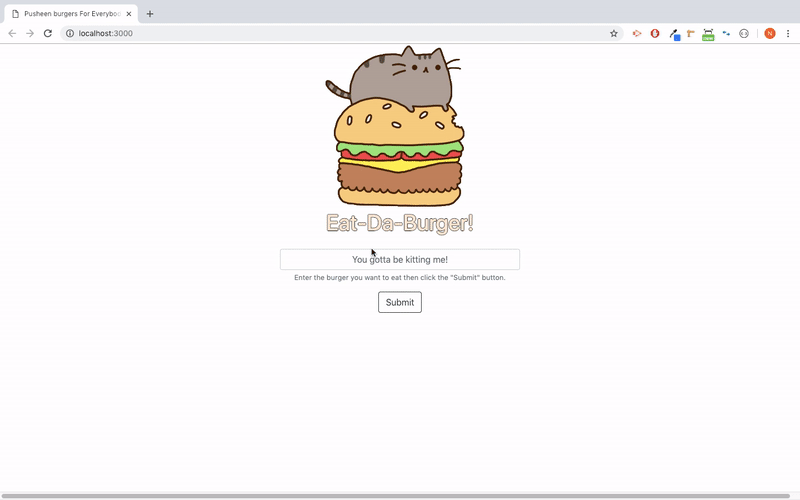

# Pusheen Sequlelized Burger Logger   😽

Created for: Northwestern Coding Bootcamp \
Deployment Date:  December 17, 2018 \
Published: Heroku <https://pusheen-burger.herokuapp.com/> \
NPM Packages: dotenv, express, express-handlebars, mysql2, sequelize

## Summary: 

Welcome the Pusheen Burger Logger that utilizes Node.js, Express, Handlebars and Sequelize!

* The user submits a burger name.

* The server logs the burger in a table in the MySQL database.

* The user can enter their name and devoure the burger.

* The server logs the customer in a new table in the MySQL database.

* Handlebars display the data to the screen.

## Notes:

This full stack JavaScript application is set up in the Model-Visual-Controller architectural pattern and JawsDB on Heroku.

## Copyright:

Natalia Kukula - 2018 

&nbsp;

Check out the original code with a homemade MySQL ORM https://github.com/nataliakukula/burger!